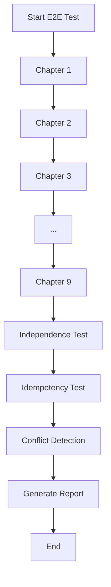

# End-to-End Testing Framework

**Purpose**: Comprehensive course validation ensuring exercise independence and sequential integrity.

---

## Overview

End-to-end (E2E) testing validates an entire course by:
1. Testing all exercises in sequential chapter order
2. Verifying each exercise runs independently
3. Detecting cross-exercise dependencies
4. Ensuring exercises can run in any order
5. Identifying cumulative issues

---

## E2E Testing Principles

### 1. Exercise Independence
**Requirement**: Each exercise must run successfully on its own, without relying on previous exercises.

**Why Important**:
- Students may skip exercises
- Exercises may be done out of order
- Lab resets should not break exercises
- Grading must work independently

**Testing Approach**:
```bash
# Test 1: Fresh lab environment
lab finish <lesson-code>
lab start <lesson-code>
# Test exercise - should work

# Test 2: After other exercises
# Run exercise A
# Run exercise B
# Re-run exercise A - should still work
```

### 2. Sequential Integrity
**Requirement**: When done in chapter order, all exercises should work without conflicts.

**Testing Approach**:
- Test chapters 1 → 2 → 3 → ... → 9 in sequence
- No lab resets between exercises (unless specified by course)
- Track state changes between exercises
- Verify no exercises break previous exercises

### 3. Idempotency
**Requirement**: Running an exercise multiple times should not cause failures.

**Testing Approach**:
```bash
# Run once
ansible-navigator run playbook.yml -m stdout
# Run again - should succeed with "ok" (no changes) or "changed" (if not idempotent)
```

---

## E2E Test Execution Phases

### PHASE 0: Course Preparation
```bash
# 1. Identify all chapters and lessons
# 2. Map chapters to lesson codes
# 3. Create test plan with exercise order
# 4. Prepare tracking spreadsheet
```

### PHASE 1: Sequential Testing
**Goal**: Test all exercises in chapter order

**Process**:
```
FOR each chapter (1 to N):
    1. Run: lab force <lesson-code>
    2. Discover all exercises for chapter
    3. FOR each exercise in chapter:
        a. Deploy solution files
        b. Run tests with ansible-navigator
        c. Record results (pass/fail/bugs)
        d. If failed: Diagnose and document
        e. Capture state (files created, services started, etc.)
    4. Verify no conflicts with previous exercises
    5. Generate chapter report
```

**State Tracking**:
- Files created/modified
- Users/groups created
- Services started
- Firewall rules added
- Packages installed

### PHASE 2: Independence Testing
**Goal**: Verify exercises run independently

**Process**:
```bash
# For each exercise:
1. lab finish <lesson-code>
2. lab start <lesson-code>
3. Run ONLY this exercise (skip all others)
4. Verify it succeeds
5. Record dependencies found

# Test cross-chapter independence:
1. Test Chapter 5 exercise BEFORE Chapter 2 exercise
2. Should both still work
```

### PHASE 3: Idempotency Testing
**Goal**: Verify exercises can be re-run

**Process**:
```bash
# For sample exercises:
1. Run exercise solution
2. Immediately re-run same exercise
3. Verify: No failures (ok or changed acceptable)
4. Record non-idempotent tasks
```

### PHASE 4: Conflict Detection
**Goal**: Find exercises that interfere with each other

**Process**:
```
1. Run exercise A
2. Run exercise B
3. Re-run exercise A - if fails, B conflicts with A
4. Document conflicts
```

---

## E2E Test Tracking

### Data Collected Per Exercise

```yaml
exercise:
  chapter: 2
  lesson_code: <lesson-code>
  exercise_name: <exercise-name>
  solution_files:
    - site.yml.sol
  test_results:
    sequential_test: pass/fail
    independence_test: pass/fail
    idempotency_test: pass/fail
  bugs_found:
    - bug_id: BUG-001
      severity: P1
      description: "..."
      fix_applied: yes/no
  state_changes:
    files_created: [...]
    users_created: [...]
    services_started: [...]
    packages_installed: [...]
  dependencies_detected: []
  run_time: "45s"
```

### Summary Metrics

```yaml
course_metrics:
  total_chapters: 9
  total_exercises: 25
  total_solution_files: 50
  pass_rate: 95%
  bugs_found: 5
  bugs_fixed: 5
  independence_violations: 0
  time_to_complete: "2 hours"
```

---

## E2E Test Report Structure

### Executive Summary
- Course: <ANSIBLE-COURSE>
- Total Exercises: X
- Pass Rate: X%
- Bugs Found: X
- Status: READY / BLOCKED

### Chapter-by-Chapter Results

```markdown
## Chapter 1: An Introduction to Ansible
- Lesson Code: <lesson-code>
- Exercises: 2
- Pass Rate: 100%
- Bugs: 0
- Status: ✅ READY

### Exercise: intro-demo
- Solution Files: demo.yml.sol
- Status: ✅ PASS
- Independence: ✅ PASS
- Idempotency: ✅ PASS
```

### Cross-Exercise Analysis

**Dependencies Found**:
- None (all exercises independent) ✅
- OR: Exercise B requires Exercise A to run first ❌

**Conflicts Detected**:
- None (no exercises interfere) ✅
- OR: Exercise B breaks Exercise A ❌

**State Accumulation**:
- Packages installed: 15 total
- Users created: 5 total
- Services running: 8 total
- Firewall rules: 12 total

### Bug Summary

| Bug ID | Exercise | Severity | Description | Status |
|--------|----------|----------|-------------|--------|
| BUG-001 | <exercise-name> | P1 | File path error | ✅ Fixed |
| BUG-002 | ... | ... | ... | ... |

---

## E2E Testing Commands

### Initialize E2E Test
```bash
# Create test tracking file
/qa e2e init <ANSIBLE-COURSE>-RHAAP2.5-en-2.epub

# Output:
# ✅ Created: <ANSIBLE-COURSE>-E2E-TEST-PLAN.json
# ✅ Mapped: 9 chapters → 9 lessons
# ✅ Found: 25 exercises
# ✅ Ready to start testing
```

### Run Full E2E Test
```bash
# Test entire course in sequential order
/qa e2e run <ANSIBLE-COURSE>-RHAAP2.5-en-2.epub

# Output:
# 🚀 Starting E2E test for <ANSIBLE-COURSE>
# 📖 Testing Chapter 1 (<lesson-code>)...
# 📖 Testing Chapter 2 (<lesson-code>)...
# ...
# ✅ E2E Test Complete
# 📊 Report: <ANSIBLE-COURSE>-E2E-REPORT.md
```

### Test Specific Chapter
```bash
/qa e2e chapter 2

# Tests only Chapter 2 exercises
```

### Verify Independence
```bash
/qa e2e verify-independence <ANSIBLE-COURSE>-RHAAP2.5-en-2.epub

# Tests exercises in random order
# Verifies each runs independently
```

---

## E2E Test Best Practices

### 1. Always Start Fresh
```bash
# Before E2E test:
lab finish <lesson-code>
lab start <lesson-code>
```

### 2. Document Everything
- Every bug found
- Every fix applied
- Every state change
- Every dependency discovered

### 3. Test Both Sequential and Random
- Sequential: Chapter 1 → 2 → 3...
- Random: Chapter 5 → 2 → 7 → 1...

### 4. Verify Idempotency
```bash
# Run twice:
ansible-navigator run playbook.yml -m stdout
ansible-navigator run playbook.yml -m stdout
# Both should succeed
```

### 5. Clean State Tracking
```bash
# Before exercise:
ls -la /etc/
ps aux | grep service
firewall-cmd --list-all

# After exercise:
# Compare - what changed?
```

---

## Common E2E Issues

### Issue 1: Exercise Dependency
**Symptom**: Exercise B fails unless Exercise A ran first

**Detection**:
```bash
lab start <lesson>
# Skip exercise A
# Run exercise B
# → FAILS
```

**Fix**: Make Exercise B independent (create required resources)

### Issue 2: State Accumulation
**Symptom**: Running all exercises creates too many resources

**Detection**: Track total users, services, packages after all exercises

**Fix**: Ensure exercises clean up or use unique resources

### Issue 3: Conflict
**Symptom**: Exercise B breaks Exercise A

**Detection**:
```bash
# Run A - passes
# Run B - passes
# Re-run A - FAILS
```

**Fix**: Ensure B doesn't modify A's resources

### Issue 4: Non-Idempotent
**Symptom**: Exercise fails when run twice

**Detection**:
```bash
# Run once - passes
# Run twice - FAILS
```

**Fix**: Use proper Ansible modules (avoid command/shell when possible)

---

## E2E Test Output Files

### Generated Files
```
<ANSIBLE-COURSE>-E2E-TEST-PLAN.json         # Test plan with all exercises
<ANSIBLE-COURSE>-E2E-RESULTS.json           # Detailed results data
<ANSIBLE-COURSE>-E2E-REPORT.md              # Human-readable report
<ANSIBLE-COURSE>-E2E-BUGS.csv               # Bug tracking spreadsheet
<ANSIBLE-COURSE>-E2E-STATE-TRACKING.json    # State changes per exercise
<ANSIBLE-COURSE>-E2E-TIMELINE.md            # Execution timeline
```

### Report Contents
- Executive summary
- Chapter-by-chapter results
- Bug analysis
- Dependency graph
- State accumulation report
- Recommendations

---

## E2E Test Success Criteria

### Required (Must Pass)
- ✅ All exercises pass individually
- ✅ All exercises pass in sequential order
- ✅ No critical (P0/P1) bugs unfixed
- ✅ No exercise dependencies detected

### Recommended (Should Pass)
- ✅ All exercises are idempotent
- ✅ No conflicts between exercises
- ✅ State accumulation is reasonable
- ✅ Exercises pass in random order

### Optional (Nice to Have)
- ✅ All exercises clean up resources
- ✅ No warnings in output
- ✅ Performance is acceptable

---

## E2E Testing Workflow



---

## Integration with QA Skill

### Usage in master_qa_prompt.md

**New PHASE 0a: E2E Test Mode**
```
When user requests E2E testing:
1. Read chapter-lesson mapping
2. Create test plan for all chapters
3. Execute tests sequentially
4. Track state changes
5. Verify independence
6. Generate comprehensive report
```

### New Commands
- `/qa e2e init <course.epub>` - Initialize E2E test
- `/qa e2e run <course.epub>` - Run full E2E test
- `/qa e2e chapter <N>` - Test specific chapter
- `/qa e2e verify-independence` - Random order test
- `/qa e2e report` - Generate final report

